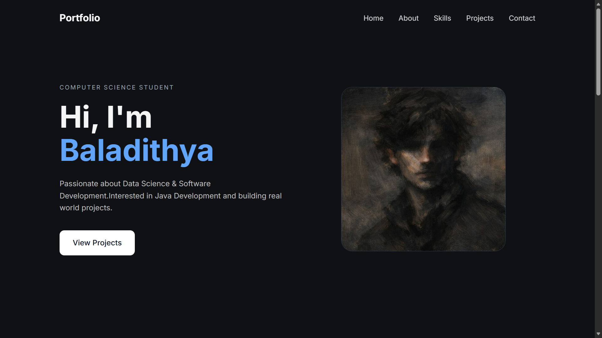
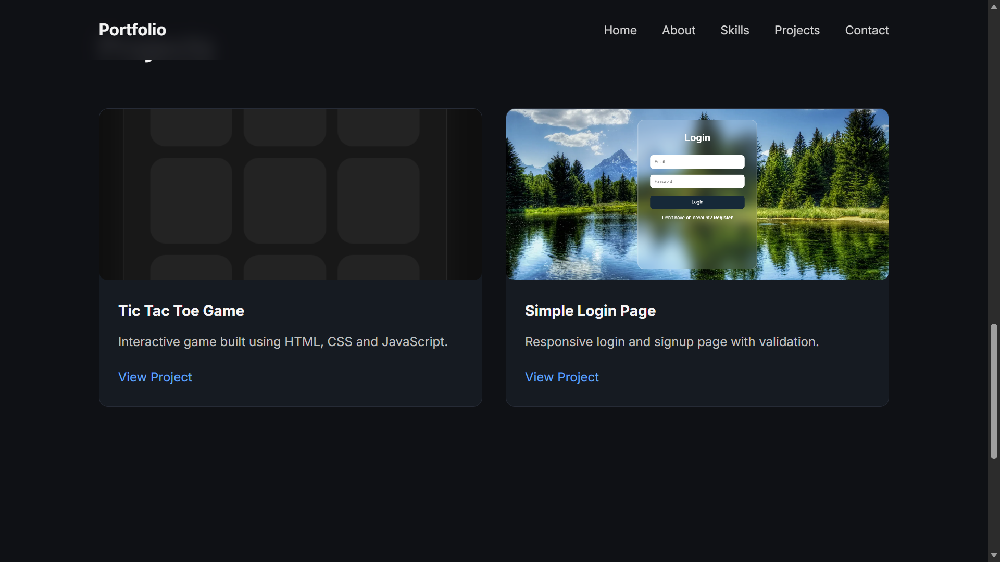

# 🌐 Personal Portfolio Website

A modern and responsive personal portfolio website designed to showcase my skills, projects, and journey as a Computer Science student and aspiring Software Engineer.

---

## 🚀 Project Overview

This portfolio website serves as my personal developer space where I present:
- My technical skills
- Featured projects
- Educational background
- Contact information
- Career interests

The project was built with a focus on clean UI, responsive design, and beginner-friendly frontend development practices.

---

## ✨ Features

✅ Responsive Design for Mobile & Desktop  
✅ Modern User Interface  
✅ Smooth Navigation  
✅ Projects Showcase Section  
✅ Skills & Technologies Section  
✅ Contact Section  
✅ Clean and Minimal Layout  
✅ Beginner-Friendly Code Structure  

---

## 🛠️ Tech Stack

| Technology | Usage |
|------------|-------|
| HTML5 | Structure |
| CSS3 | Styling |
| JavaScript | Interactivity |
| Git | Version Control |
| GitHub | Project Hosting |

---

## 📸 Screenshots

### 🖥️ Homepage


### 🚀 Projects Section


---

## ⚙️ Installation & Setup

1. Clone the repository

```bash
git clone https://github.com/baladithyamuthireddy-hub/My-Portfolio.git
```

2. Open the project folder

```bash
cd Portfolio
```

3. Run the project

Simply open `index.html` in your browser.

---

## 📂 Project Structure

```bash
portfolio/
│
├── index.html
├── style.css
├── script.js
└── README.md
```

---

## 🌱 Future Improvements

- Add dark/light mode
- Integrate backend contact form
- Add animations and transitions
- Deploy with custom domain
- Add more real-world projects
- Improve accessibility

---

## 📚 Learning Outcomes

Through this project, I learned:

- Responsive web design principles
- Better HTML semantic structure
- CSS styling and layouts
- JavaScript DOM interactions
- Git & GitHub workflow
- Hosting and managing projects online

---

## 🌐 Live Demo

🔗 https://baladithyamuthireddy-hub.github.io/My-Portfolio/#projects
```
```

## 🤝 Connect With Me

- GitHub: https://github.com/baladithyamuthireddy-hub
- LinkedIn: https://www.linkedin.com/in/baladithya-muthireddy-994a00381

---

## ✨ Quote

> “Build projects that reflect your growth as a developer.”

---

⭐ If you like this project, consider giving it a star!
